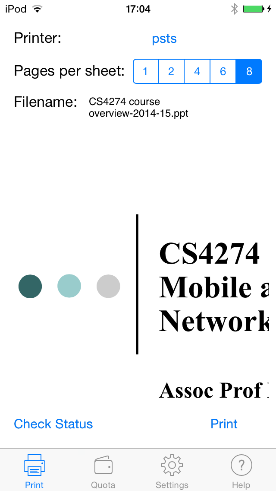
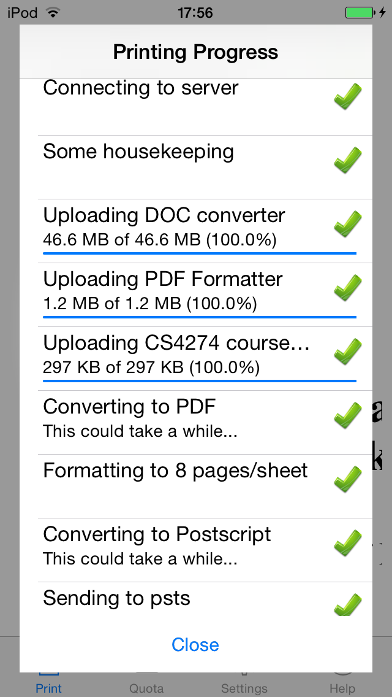
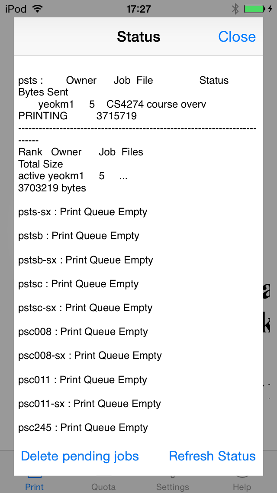
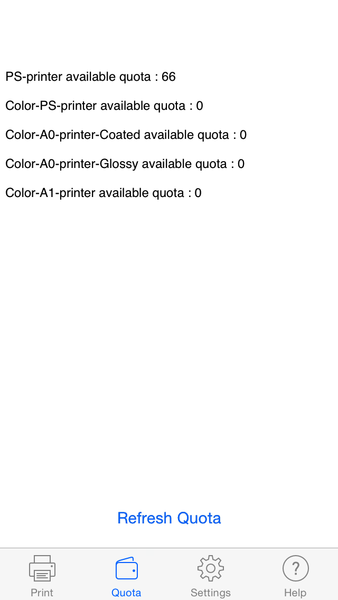

nus-soc-print-ios
=================

An iOS-Swift application that prints office documents and PDF files to Unix printers in NUS School Of Computing via SSH. The Android version exists [here](https://github.com/yeokm1/nus-soc-print/).

This app has been approved on the [App Store](https://itunes.apple.com/sg/app/id916524327).

##Features
1. Print PDF, DOC, DOCX, PPT, PPTX and ODT files
2. Page range to be printed
3. Remaining quota check
4. Print Status Check
5. Page formatting for documents
6. Accepts file exports from other apps like IVLE, Dropbox, Google Drive and the web browser.
7. Deleting of existing job in print queue
8. Runs on iOS7.0 and up for maximum compatibility

##The original HacknRoll 2014 Video

 Narrated by Yong Quan

##Screenshots

View more screenshots in the screenshots directory.

Dependencies
=====
1. Swift language
2. Xcode 6
3. Cocoapods
4. NMSSH SSH library (installed via Cocoapods)
5. Google Analytics (installed via Cocoapods)
6. Docs to PDF converter (Included in repo). From [another project of mine](https://github.com/yeokm1/docs-to-pdf-converter).

##Compiling the project
1. Swift is only available from Xcode 6 so you have to use that.
2. Install Cocoapods `sudo gem install cocoapods`.
3. Change directory to where you pulled the project and run `pod install`.
4. Open the project using `NUS SOC Print.xcworkspace` instead of the `.xcodeproject` file.
5. You may need to adjust the team name to deploy on your personal device. Go to Project Settings, General, NUS SOC Print Target. Choose None or your team name from the drop down menu.

##Special thanks to:
1. Kai Yao and Yong Quan for the initial codes and design.
2. Lenny for the app icon.
3. Zit Seng's help on Sunfire and advice on NUS's intellectual property issues
4. My CS3217 Prof Khe Chai for the initial guidance on publishing iOS apps.
5. Vishnu's advice on iOS App submissions.

##References
1. [Display UIViewController as Popup](http://stackoverflow.com/questions/16230700/display-uiviewcontroller-as-popup-in-iphone)
2. [Update View Controller when application did become active](http://stackoverflow.com/questions/10359186/how-to-tell-the-active-view-controller-when-applicationdidbecomeactive-is-called)
3. [Solve weird linker problems](http://stackoverflow.com/questions/25371556/swift-beta-6-confusing-linker-error-message)
