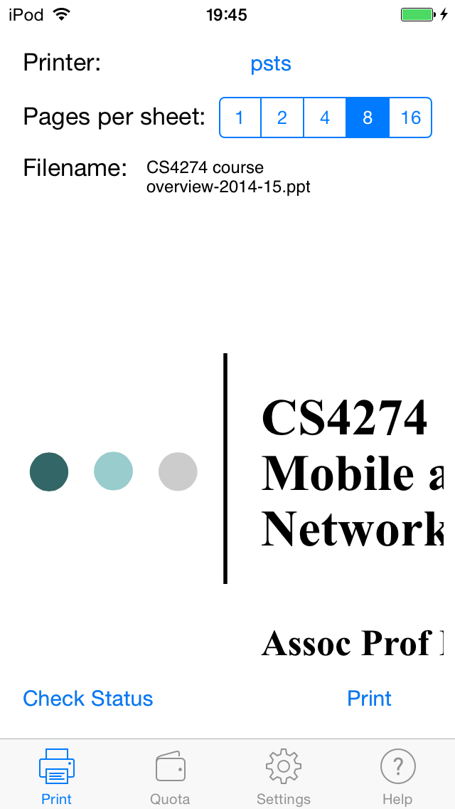

nus-soc-print-ios
=================

An iOS-Swift application that prints office documents and PDF files to Unix printers in NUS School Of Computing. This is a port from my [Android App](https://github.com/yeokm1/nus-soc-print/). Certain features I felt that are hardly used have been dropped compared to the Android version to improve the UI cleanliness. 

I'm waiting for Apple to start accepting Swift app submissions on the App Store before doing so myself.

##Features
1. Print PDF, DOC, DOCX, PPT, PPTX and ODT files
2. Remaining quota check
3. Print Status Check
4. Page formatting for documents
5. Accepts file exports from other apps like IVLE and Dropbox.
6. Deleting of existing job in print queue
7. Runs on iOS7.0 and up for maximum compatibility

##Screenshots

View more screenshots in the screenshots directory.

Dependencies
=====
1. Swift language
2. Xcode 6 beta 6
3. Cocoapods
4. NMSSH SSH library (installed via Cocoapods)

##Compiling the project
1. Swift is only available from Xcode 6 beta so you have to download and install manually from Apple's website
2. Install Cocoapods `sudo gem install cocoapods`
3. Change directory to where you pulled the project and run `pod install`
4. Open the project using `NUS SOC Print.xcworkspace` instead of the `.xcodeproject` file

##Credits
Many thanks to Kai Yao and Yong Quan for initially working with me during the HacknRoll 2014 to kickstart this app. I just brought it to (nearly) the finish line.
